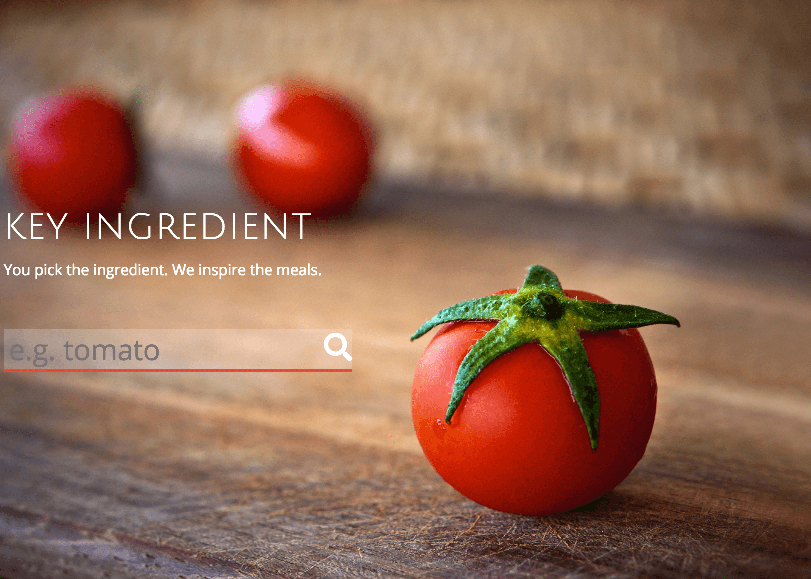
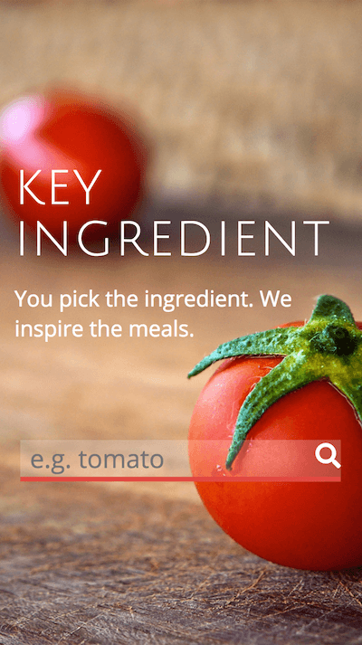
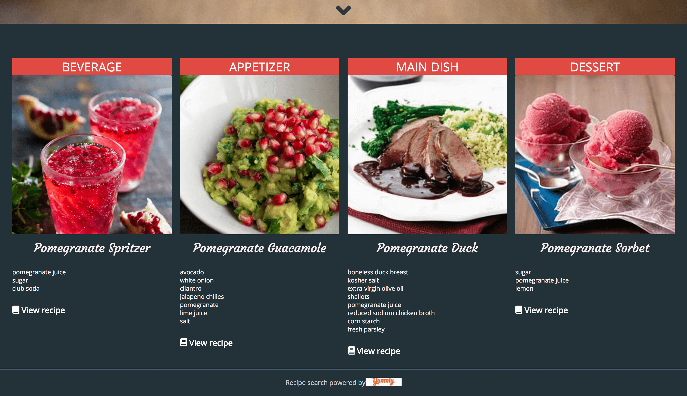
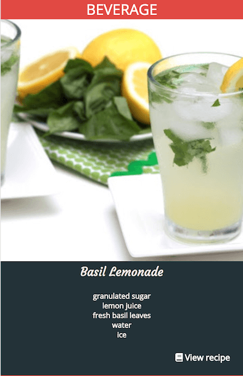

# Key Ingredient

A web app that allows users to search for a specific ingredient and returns results of different courses that contain that ingredient.

## Screenshots

Desktop home page view

Mobile home page view  

Desktop results view

Mobile result view  

## Demo

[Live Demo](https://velafarq.github.io/Key-Ingredient/)

## Summary

Key Ingredient is a web application that presents the user with a search box which allows the user to type in any ingredient they choose and submit. Upon submission, the ingredient they typed will be used as a keyword to search through the Yummly recipe database to access recipes for a beverage, appetizer, main dish and dessert that all have this keyword as a common ingredient. The purpose is to inspire the user to use an ingredient in a way that they may not have thought of.

## Built Using

- html
- css
- JavaScript
- Utilizes Yummly GET API
